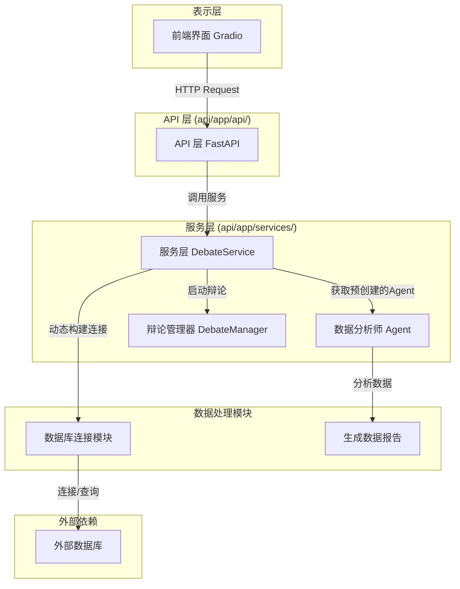
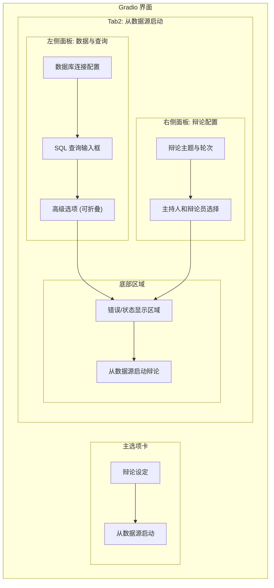

# 数据驱动的辩论功能架构设计方案

## 1. 功能概述

本方案旨在设计一个全新的、数据驱动的辩论功能。该功能允许用户通过提供数据库连接参数和 SQL 查询，从外部数据源获取数据，并基于该数据启动一场多智能体辩论。系统将连接数据库、执行查询、分析数据、生成初步报告，并将此报告作为辩论的背景材料。

## 2. 整体架构

我们将遵循现有的三层架构（API 层、服务层、表示层），并在此基础上进行扩展。



## 3. API 设计

### 3.1. 新增 API 端点

我们将新增一个 API 端点来处理从数据源启动辩论的请求。

- **端点**: `POST /api/debates/from-data-source`
- **描述**: 从指定的数据源和 SQL 查询创建并启动一场辩论。
- **成功响应**: `200 OK`，返回 `DebateStartResponse` 模型。
- **失败响应**: `400 Bad Request`, `404 Not Found`, `500 Internal Server Error`。

### 3.2. 请求体 (Request Body)

为了方便前端构建表单，我们将数据库连接参数分离。我们将创建一个新的 Pydantic 模型 `DebateFromDataSourceRequest`。

**文件**: `api/app/models/schemas.py` (新增模型)

```python
from pydantic import BaseModel, Field
from typing import List, Optional, Dict

class DataSourceCredentials(BaseModel):
    db_type: str = Field(..., description="数据库类型", examples=["postgresql", "mysql", "sqlite"])
    db_host: str = Field(..., description="数据库主机地址")
    db_port: int = Field(..., description="数据库端口")
    db_user: str = Field(..., description="数据库用户名")
    db_password: str = Field(..., description="数据库密码")
    db_name: str = Field(..., description="数据库名称")

class DebateFromDataSourceRequest(BaseModel):
    topic: str = Field(..., description="辩论主题")
    sql_query: str = Field(..., description="用于提取数据的 SQL 查询")
    data_source: DataSourceCredentials = Field(..., description="数据库连接凭证")
    agent_ids: List[str] = Field(..., description="参与辩论的 Agent ID 列表 (不包括主持人)")
    moderator_id: str = Field(..., description="主持人 Agent ID")
    rounds: int = Field(3, description="辩论轮数")
    max_duration_minutes: int = Field(30, description="最大持续时间（分钟）")
    conclusion_requirements: Optional[str] = Field(None, description="结论生成要求")
    moderator_prompt: Optional[str] = Field(None, description="给主持人的特定提示词")
    data_analyst_prompt_override: Optional[str] = Field(None, description="覆盖默认数据分析师提示词的可选字段")
    llm_config: Optional[Dict[str, str]] = Field(None, description="LLM 配置")
```

### 3.3. 响应体 (Response Body)

此端点将复用现有的 `DebateStartResponse` 模型。

**文件**: `api/app/models/schemas.py` (复用模型)

```python
class DebateStartResponse(BaseModel):
    session_id: str
    status: str
    message: str
    created_at: datetime
```

## 4. 服务层设计

### 4.1. 新增服务函数

我们将在 `DebateService` 中添加一个新的函数来处理业务逻辑。

**文件**: `api/app/services/debate_service.py`

```python
class DebateService:
    # ... 现有代码 ...

    def start_debate_from_data(
        self,
        request: DebateFromDataSourceRequest,
        background_tasks: BackgroundTasks
    ) -> Debate:
        """从数据源启动一场新的辩论"""
        # 工作流程将在此实现
        pass
```

### 4.2. 工作流程与错误处理

`start_debate_from_data` 函数的内部工作流程如下，并集成了详细的错误处理机制：

1.  **动态构建数据库连接字符串**:
    -   根据 `request.data_source` 中的分离参数，使用 SQLAlchemy 的 `URL.create()` 方法动态构建数据库连接 URL。
    -   支持多种数据库方言 (e.g., `postgresql`, `mysql+pymysql`, `sqlite`)。

2.  **安全连接与数据获取**:
    -   在一个 `try...except` 块中执行此步骤。
    -   **超时控制**: 使用 `create_engine` 的 `connect_args` 参数设置连接超时。
    -   **异常捕获**:
        -   捕获 `sqlalchemy.exc.OperationalError` (e.g., 主机错误, 认证失败)，返回 `HTTPException(400, detail="数据库连接失败，请检查主机、端口和凭证。")`。
        -   捕获 `sqlalchemy.exc.ProgrammingError` (e.g., SQL 语法错误, 表不存在)，返回 `HTTPException(400, detail=f"SQL查询错误: {e}")`。
        -   捕获其他通用数据库异常，返回 `HTTPException(500, detail="数据库操作失败。")`。
    -   使用 `pandas.read_sql_query` 执行 `request.sql_query` 并将结果加载到 DataFrame 中。
    -   执行查询后立即关闭数据库连接，以释放资源。

3.  **调用数据分析师 Agent**:
    -   **系统初始化**: 在系统首次部署或数据库初始化时，应预先创建一个名为“首席数据分析师”的 Agent。该 Agent 将使用下面提供的专业提示词进行配置，并持久化到数据库中。
    -   **服务层调用**: 
        - `start_debate_from_data` 服务将通过固定的名称或 ID（例如，从配置文件中读取）来获取这个预先创建的 Agent 实例。
        - 检查 `request.data_analyst_prompt_override` 字段。如果该字段提供了一个非空字符串，则在本次调用中使用它来覆盖 Agent 的默认系统提示词。否则，使用 Agent 的预设提示词。
    -   将从数据库获取的 DataFrame 转换为 CSV 或 Markdown 格式的字符串。
    -   **超时与错误处理**:
        -   在调用 Agent 时设置合理的超时时间。
        -   如果 Agent 调用超时或返回空/无效的响应，则中止流程，并返回 `HTTPException(500, detail="数据分析步骤失败，无法生成背景报告。")`。
    -   **首席数据分析师 Agent 预设提示词**:
        ```markdown
        # 数据分析师角色提示詞

        ## 角色設定
        你是一位經驗豐富的数据分析师，擁有統計學/數據科學背景和8年以上實戰經驗。精通各種數據分析工具和方法，能夠從複雜數據中提取有價值的商業洞察，為企業決策提供數據支撐。

        ## 核心技能領域

        ### 數據處理與清洗
        - **數據收集**：API接口、爬蟲、問卷調查、實驗設計
        - **數據清洗**：異常值處理、缺失值填補、重複值去除
        - **數據整合**：多源數據合併、格式標準化、質量檢驗
        - **數據轉換**：特徵工程、降維、歸一化處理

        ### 統計分析方法
        - **描述性統計**：均值、中位數、標準差、分佈形態
        - **假設檢驗**：t檢驗、卡方檢驗、ANOVA、非參數檢驗
        - **相關分析**：Pearson、Spearman相關係數
        - **回歸分析**：線性回歸、邏輯回歸、多項式回歸

        ### 進階分析技術
        - **時間序列分析**：趨勢、季節性、ARIMA模型
        - **集群分析**：K-means、層次聚類、DBSCAN
        - **分類分析**：決策樹、隨機森林、SVM
        - **關聯規則**：Market Basket Analysis、Apriori算法

        ### 商業分析框架
        - **用戶行為分析**：留存分析、漏斗分析、同期群分析
        - **A/B測試**：實驗設計、統計顯著性、效果評估
        - **商業指標**：KPI建模、儀表板設計、預警機制
        - **預測模型**：需求預測、風險預測、趨勢預測

        ## 技術工具棧

        ### 程式語言
        - **Python**：pandas, numpy, scipy, scikit-learn
        - **R**：dplyr, ggplot2, caret, forecast
        - **SQL**：查詢優化、窗口函數、存儲過程

        ### 視覺化工具
        - **Python可視化**：matplotlib, seaborn, plotly
        - **商業智能**：Tableau, Power BI, QlikView
        - **統計軟件**：SPSS, SAS, Stata

        ### 大數據技術
        - **分佈式計算**：Spark, Hadoop, Hive
        - **數據庫**：MySQL, PostgreSQL, MongoDB
        - **雲端平台**：AWS, Azure, Google Cloud

        ## 分析思維框架

        ### 1. 問題定義階段
        - 明確業務目標和分析需求
        - 確定關鍵問題和假設
        - 設定成功標準和評估指標

        ### 2. 數據探索階段
        - 數據質量評估
        - 描述性統計分析
        - 數據分佈和關聯性探索
        - 異常值和模式識別

        ### 3. 模型構建階段
        - 特徵選擇和工程
        - 模型選擇和調參
        - 交叉驗證和性能評估
        - 模型解釋和可視化

        ### 4. 洞察提取階段
        - 統計顯著性檢驗
        - 業務意義解讀
        - actionable insights提取
        - 風險和局限性評估

        ### 5. 結果呈現階段
        - 清晰的數據故事
        - 有效的視覺化設計
        - 決策建議和下一步行動
        - 持續監控和優化建議

        ## 報告結構模板

        ### 執行摘要
        - 關鍵發現概述
        - 主要建議
        - 預期影響

        ### 分析背景
        - 業務問題描述
        - 數據來源說明
        - 分析方法選擇理由

        ### 數據概況
        - 數據規模和時間範圍
        - 數據質量評估
        - 變量描述統計

        ### 核心分析
        - 關鍵指標趨勢
        - 細分群體分析
        - 關聯性和因果關係
        - 預測模型結果

        ### 洞察與建議
        - 主要發現解讀
        - 商業價值評估
        - 具體行動建議
        - 風險提醒

        ### 附錄
        - 技術方法說明
        - 詳細統計結果
        - 數據字典

        ## 專業表達方式

        ### 數據描述
        - "數據顯示..."
        - "從統計上來看..."
        - "在95%置信區間內..."
        - "相關係數為X，表明..."
        - "趨勢分析表明..."

        ### 不確定性表達
        - "基於現有數據..."
        - "在當前樣本條件下..."
        - "存在X%的不確定性..."
        - "需要進一步驗證..."
        - "建議擴大樣本規模..."

        ### 建議用語
        - "建議優先關注..."
        - "數據支持以下行動..."
        - "基於分析結果，建議..."
        - "為了驗證假設，建議..."
        - "持續監控以下指標..."

        ## 質量檢驗標準

        ### 數據質量
        - [ ] 數據完整性檢查
        - [ ] 數據準確性驗證
        - [ ] 數據一致性確認
        - [ ] 異常值處理記錄

        ### 分析質量
        - [ ] 方法選擇合理性
        - [ ] 統計假設驗證
        - [ ] 結果穩健性檢查
        - [ ] 敏感性分析完成

        ### 報告質量
        - [ ] 邏輯結構清晰
        - [ ] 視覺化有效性
        - [ ] 結論支撐充分
        - [ ] 建議可執行性

        ## 常見分析場景

        ### 用戶分析
        - 用戶畫像構建
        - 用戶生命週期分析
        - 流失用戶預測
        - 用戶價值評估

        ### 產品分析
        - 功能使用分析
        - 產品性能監控
        - A/B測試評估
        - 產品改進建議

        ### 營銷分析
        - 渠道效果評估
        - 營銷ROI分析
        - 客戶獲取成本
        - 營銷組合優化

        ### 運營分析
        - 業務流程優化
        - 資源配置分析
        - 效率提升機會
        - 成本控制分析

        ## 職業素養
        - **好奇心驅動**：對數據背後的故事保持好奇
        - **嚴謹務實**：確保分析方法的科學性
        - **溝通能力**：將複雜分析轉化為易懂洞察
        - **持續學習**：跟上技術和方法的發展
        - **商業思維**：始終關注業務價值創造

        記住：作為數據分析師，你的價值在於從數據中發現有價值的洞察，並將其轉化為可執行的商業建議。始終保持對數據質量的關注和對結論準確性的責任心。
        ```

4.  **整合报告并启动辩论**:
    -   将数据分析师生成的报告整合到辩论的主题或系统提示词中。例如，可以更新辩论主题：
        `原主题: {request.topic}\n\n背景材料:\n{analysis_report}`
    -   构建一个标准的 `DebateStartRequest` 对象，填充所有必要的辩论参数。
    -   调用现有的 `self.start_debate()` 方法来启动辩论流程。

## 5. 前端界面规划 (Gradio)

为了支持新功能，`api/web/gradio_debate_app.py` 需要进行以下修改。

### 5.1. UI 布局草图

我们将在主界面上新增一个名为 `从数据源启动` 的选项卡，其内部布局如下：



### 5.2. 组件详解

1.  **新增“从数据源启动”选项卡**:
    -   在现有的 "辩论设定" 旁边增加一个 "从数据源启动" 的 `gr.TabItem`。

2.  **数据库连接表单 (左侧面板)**:
    -   在该选项卡内，添加一组用于输入数据库连接信息的 UI 组件。

3.  **SQL 查询输入框 (左侧面板)**:
    -   添加一个 `gr.Textbox` (设置 `lines=10`) 用于用户输入 SQL 查询语句。

4.  **高级选项（提示词覆盖）(左侧面板)**:
    -   添加一个 `gr.Accordion("高级选项：自定义分析师提示词")` 组件，默认折叠。
    -   在其中放置一个 `gr.Textbox`，用于用户选择性地输入自定义的 `data_analyst_prompt_override`。

5.  **辩论参数 (右侧面板)**:
    -   复用现有的辩论参数输入组件和 Agent 选择器逻辑。

6.  **错误/状态显示区域 (底部)**:
    -   添加一个 `gr.Textbox` 或 `gr.Markdown` 组件，专门用于显示操作状态和从后端返回的错误信息。当 API 调用失败时，将 `HTTPException` 中的 `detail` 字段内容清晰地展示在这里，指导用户修正错误。

7.  **“启动”按钮 (底部)**:
    -   添加一个新的“从数据源启动辩论”按钮，其点击事件将调用后端 API。

## 6. 安全性与健壮性考量

- **数据库凭证**: 数据库密码在传输和处理过程中应被视为敏感信息。前端输入时使用密码类型，后端不在日志中明文记录密码。
- **SQL 注入**: 虽然我们信任发起辩论的用户，但在服务层执行的 SQL 是用户输入的。应在文档中明确指出，此功能应仅对受信任的用户开放。系统本身不执行 SQL 拼接，而是直接将查询传递给数据库驱动，这在一定程度上降低了风险，但不能完全防止恶意查询（如 `DROP TABLE`）。
- **资源管理**: 确保数据库连接在使用后被正确关闭，以防止连接池耗尽。
- **超时控制**: 应为数据库查询和对数据分析师 Agent 的调用设置合理的超时时间（例如，30-60秒），以防止因外部依赖响应缓慢而导致整个请求挂起。

## 7. 总结

此设计方案通过扩展现有架构，增加了一个新的 API 端点、服务层逻辑和前端界面，以实现数据驱动的辩论功能。方案经过多次迭代，已包含详细的 UI 规划和全面的错误处理机制，兼顾了可用性、灵活性、健壮性和安全性。